# $A_{0}$: An Affordance-Aware Hierarchical Model for General Robotic Manipulation
### [](https://arxiv.org/abs/2504.12636) | [](https://a-embodied.github.io/A0/) |[](https://huggingface.co/collections/JianZhangAI/a0-681db29ec18ddb53c7e5a33f)
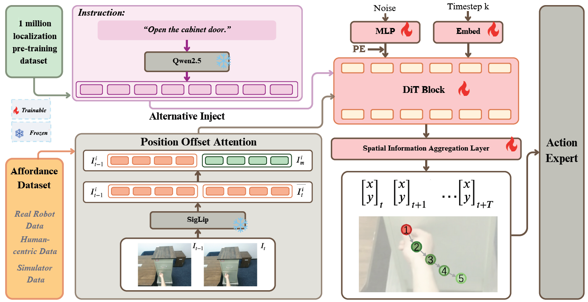 

Example results on HOI4D dataset
| 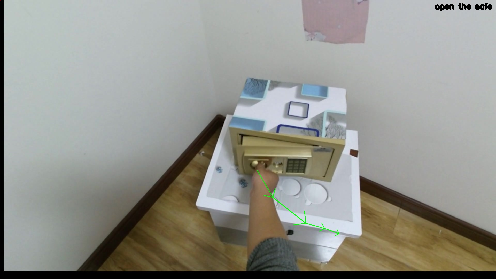 | 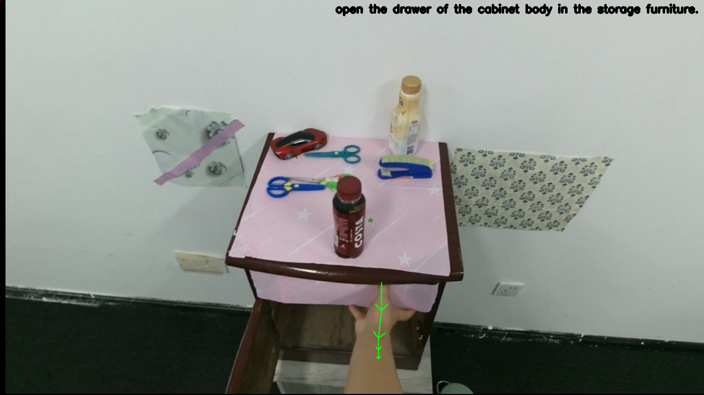 | 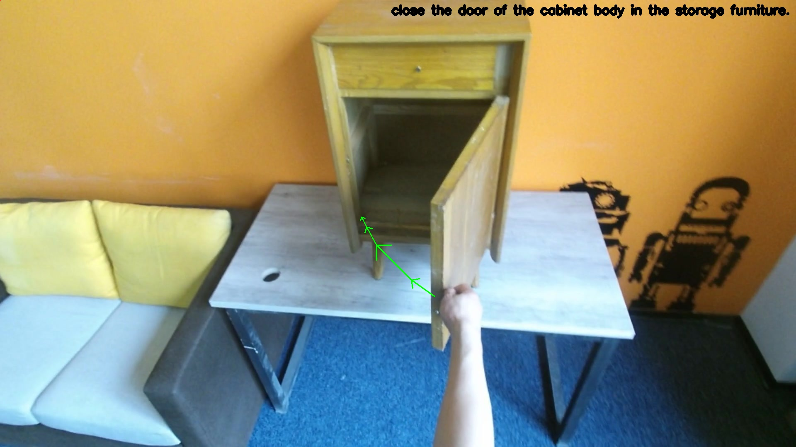 |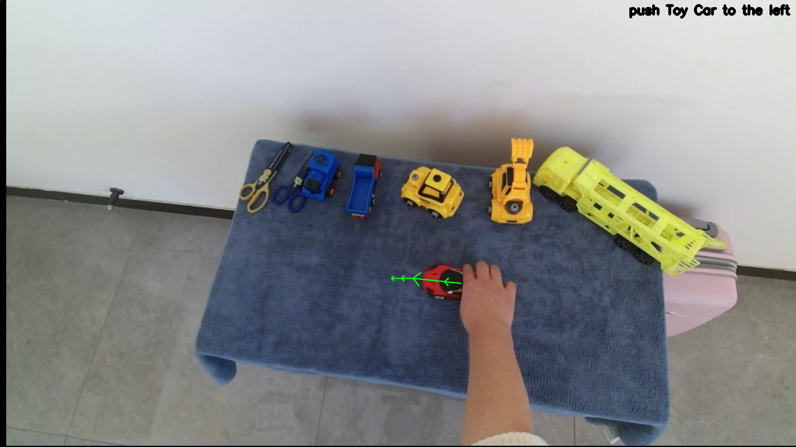 |
|:------------------------:|:------------------------:|:------------------------:|:------------------------:|


Example results on Maniskill
| 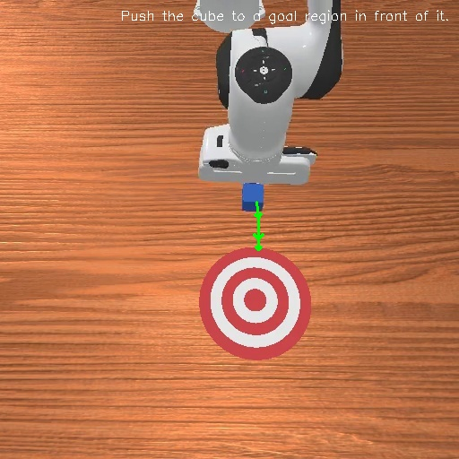 | 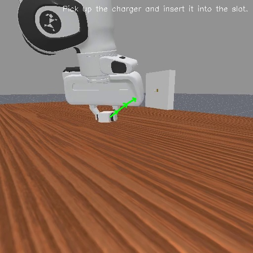 | 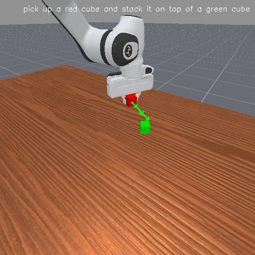 | |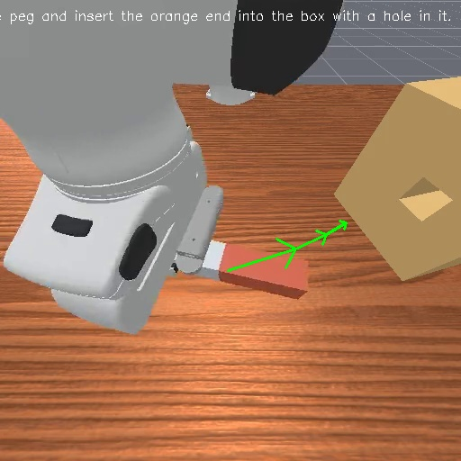 |
|:------------------------:|:------------------------:|:------------------------:|:------------------------:|:------------------------:|

Example results on DROID dataset
| 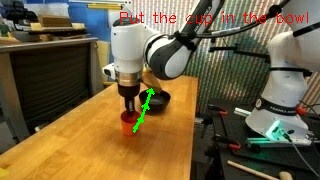 | 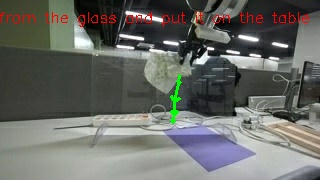 | 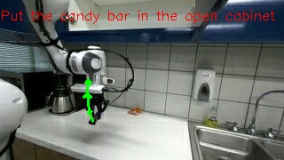 |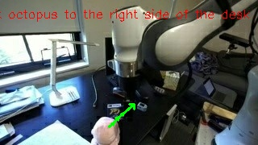 |
|:------------------------:|:------------------------:|:------------------------:|:------------------------:|


## Environment Setup

```bash
git clone https://github.com/A-embodied/A0.git
cd A0

conda create -n a0env python=3.10.0
conda activate a0env

# Install pytorch
# Look up https://pytorch.org/get-started/previous-versions/ with your cuda version for a correct command
pip install torch==2.1.0 torchvision==0.16.0  --index-url https://download.pytorch.org/whl/cu121

# Install flash-attn
pip install flash-attn --no-build-isolation
# or install prebuilt flash-attn wheels for faster setup: https://github.com/mjun0812/flash-attention-prebuild-wheels


# Install other prerequisites
pip install -r requirements.txt
```

## Download Off-the-shelf Vision & Text Encoders
   <!-- - `t5-v1_1-xxl`: [link](https://huggingface.co/google/t5-v1_1-xxl/tree/main)🤗 -->
   - `Qwen2.5-7B`:[link](https://huggingface.co/Qwen/Qwen2.5-7B)🤗
   - `siglip`: [link](https://huggingface.co/google/siglip-so400m-patch14-384)🤗
   
Link the encoders to the repo directory:

   ```bash
   # Under the root directory of this repo
   mkdir -p google
   mkdir -p Qwen
   
   # Link the downloaded encoders to this repo
   ln -s /path/to/Qwen2.5-7B Qwen/Qwen2.5-7B
   ln -s /path/to/siglip-so400m-patch14-384 google/siglip-so400m-patch14-384
   ```

## Data
Download [A0-Dataset](https://huggingface.co/datasets/JianZhangAI/A0-Dataset/tree/main) from Huggingface🤗 and unzip the zip files. Your dataset directory should look like:
```
├── maniskill # maniskill_path
├── droid-cotrack # droid_cotrack_path
├── droid_molmo_sam2 # droid_molmo_sam2_path
├── hoi4d_metadata # hoi4d_metadata_path
├── hoi4d_frame # hoi4d_frame_selection_path
└── HOI4D_release # hoi4d_rgb_path

```
Then set the dataset paths in [configs/base.yaml](configs/base.yaml):
```yaml
# ...

dataset:
  droid_cotrack_path: /path/to/droid_cotrack
  droid_molmo_sam2_path: /path/to/droid_molmo_sam2
  hoi4d_metadata_path: /path/to/hoi4d_metadata
  hoi4d_rgb_path: /path/to/HOI4D_release
  hoi4d_frame_selection_path: /path/to/hoi4d_frame
  maniskill_path: /path/to/maniskill
```
Decompose the videos of HOI4D_release dataset into images using ffmpeg via official Python script file [decode.py](https://github.com/leolyliu/HOI4D-Instructions/blob/main/utils/decode.py):
```bash
python utils/decode.py
```


## Train
First, set some variables in the [train.sh](./train.sh).

Run `ifconfig` to find your network interface, then `export NCCL_SOCKET_IFNAME=<iface>`.

Run `ibstat` to identify your InfiniBand device, then `export NCCL_IB_HCA=<device:port>`.

Set `OUTPUT_DIR` and `CUDA_VISIBLE_DEVICES`.

Optionally, you can download the model pre-trained on 1 million pixmo-points dataset: 🤗[A0-1B-pretrain](https://huggingface.co/JianZhangAI/A0-1B-pretrain/tree/main). <br>
And set `--pretrained_model_name_or_path` to load it as initial parameters.

```bash
source train.sh
```
In our experiments, we used a batch size of 200 and trained the model for 30,000 steps. <br>
If you set `the hidden_size` to 1024 and the `depth` to 14 in [configs/base.yaml](configs/base.yaml), you will obtain a model with 170 million parameters.

## Test 
You can test using your own trained model or the pre-trained model (🤗[A0-1B](https://huggingface.co/JianZhangAI/A0-1B) and [A0-170M](https://huggingface.co/JianZhangAI/A0-170M)).<br>
Set the variables `PRETRAINED_MODEL_NAME_OR_PATH` in [test_dataset.sh](./test_dataset.sh)
```bash
# test performance on Maniskill dataset
bash test_dataset.sh maniskill
# test performance on HOI4D Frame Seclection dataset
bash test_dataset.sh hoi4d_frame
# test performance on HOI4D dataset
bash test_dataset.sh hoi4d
# test performance on DROID dataset
bash test_dataset.sh droid
```

## Inference
You can test using your own trained model or the pre-trained model (🤗[A0-1B](https://huggingface.co/JianZhangAI/A0-1B) and [A0-170M](https://huggingface.co/JianZhangAI/A0-170M)).
```bash 
# set keyword arguments --pretrained_model_name_or_path, --instruction and --image_path
bash inference.sh
```

## Citation
```
@article{xu2025a0,
      title={A0: An Affordance-Aware Hierarchical Model for General Robotic Manipulation}, 
      author={Rongtao Xu and Jian Zhang and Minghao Guo and Youpeng Wen and Haoting Yang and Min Lin and Jianzheng Huang and Zhe Li and Kaidong Zhang and Liqiong Wang and Yuxuan Kuang and Meng Cao and Feng Zheng and Xiaodan Liang},
      journal={arXiv preprint arXiv:2504.12636},
      year={2025},
}
```

## Acknowledgement
[RDT-1B](https://github.com/thu-ml/RoboticsDiffusionTransformer)